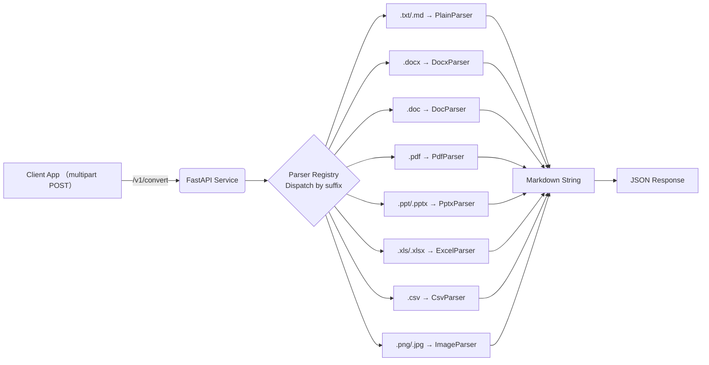

# MedicNex File2Markdown 设计文档

> **目标**：实现一个基于 Python 的微服务，接收用户通过 HTTP `POST` 上传的各种文档与图片，将其内容转换为 Markdown 文本并返回。图片将调用视觉大模型完成内容识别与 OCR，结果同样以文本形式返回。本服务需支持密钥（API Key）鉴权。

---

## 1. 技术栈与核心依赖

| 领域          | 选型                                                                                                                                                               | 说明                      |
| ----------- | ---------------------------------------------------------------------------------------------------------------------------------------------------------------- | ----------------------- |
| Web 框架      | **FastAPI** + Uvicorn                                                                                                                                            | 异步高性能，方便集成依赖注入与 OpenAPI |
| 数据验证        | **Pydantic v2**                                                                                                                                                  | 请求/响应模型校验               |
| 鉴权          | 自定义 API Key Header + HMAC/Redis 存储                                                                                                                               | 可水平扩展                   |
| 文档解析        | • `python-docx`（DOCX）<br>• `mammoth`（DOC→HTML→MD）<br>• `pdfplumber`（PDF）<br>• `python-pptx`（PPT/PPTX）<br>• `pandas` + `tabulate`（XLS/XLSX/CSV）<br>• 内置解析（TXT/MD） | 统一输出 Markdown           |
| Markdown 生成 | **markdownify / mistune**                                                                                                                                        | 富文本 → MD                |
| 图片识别        | **OpenAI Vision API**（或其他视觉大模型） + **Tesseract OCR**（可选）                                                                                                          | 返回标签、描述与文字              |
| 日志          | **loguru**                                                                                                                                                       | JSON 结构化日志              |
| 部署          | Docker + Gunicorn/Uvicorn Worker                                                                                                                                 | 12‑factor 兼容            |

---

## 2. 功能概览



---

## 3. API 设计

### 3.1 端点

| Method | Path          | 功能          |
| ------ | ------------- | ----------- |
| `POST` | `/v1/convert` | 上传文件并返回转换结果 |
| `GET`  | `/v1/health`    | 健康检查        |

### 3.2 请求

```http
POST /v1/convert HTTP/1.1
Host: api.example.com
Authorization: Bearer <API_KEY>
Content-Type: multipart/form-data; boundary=----WebKitForm

------WebKitForm
Content-Disposition: form-data; name="file"; filename="slides.pptx"
Content-Type: application/vnd.openxmlformats-officedocument.presentationml.presentation

<binary>
------WebKitForm--
```

### 3.3 响应

```jsonc
{
  "filename": "slides.pptx",
  "size": 1280345,
  "content_type": "application/vnd.openxml...",
  "markdown": "# 幻灯片标题\n\n- 要点一\n- 要点二\n\n\n",
  "duration_ms": 420
}
```

### 3.4 错误码

| HTTP | code               | 说明                      |
| ---- | ------------------ | ----------------------- |
| 401  | `INVALID_API_KEY`  | API Key 缺失或无效           |
| 415  | `UNSUPPORTED_TYPE` | 不支持的文件类型                |
| 422  | `PARSE_ERROR`      | 解析失败（详细信息在 `detail` 字段） |

---

## 4. 鉴权策略

1. **配置**：环境变量 `AGENT_API_KEYS="key1,key2,..."` 或持久化存储（Redis/PostgreSQL）。
2. **客户端**：须在 `Authorization` 头携带 `Bearer <API_KEY>`。
3. **服务端**：

   ```python
   from fastapi import Depends, HTTPException, Security, Header

   async def get_api_key(authorization: str = Header(...)):
       prefix, _, token = authorization.partition(" ")
       if prefix.lower() != "bearer" or token not in API_KEYS:
           raise HTTPException(401, "INVALID_API_KEY")
       return token
   ```

---

## 5. 解析器实现要点

| 文件类型           | 解析步骤                                                        | 辅助库                      |
| -------------- | ----------------------------------------------------------- | ------------------------ |
| **TXT / MD**   | 直接 `str.decode()` 读入                                        | —                        |
| **DOCX**       | `python-docx` 遍历段落→HTML→`markdownify`                       | python-docx, markdownify |
| **DOC**        | `mammoth` ⟶ HTML ⟶ Markdown                                 | mammoth                  |
| **PDF**        | `pdfplumber` 抽取文本；若页面含图，保存临时 PNG 送 vision API               | pdfplumber, pillow       |
| **PPT / PPTX** | `python-pptx` 遍历 Slide→Shape；文本→列表，图片→临时文件                  | python-pptx              |
| **XLS / XLSX** | `pandas.read_excel()`→`tabulate(table, tablefmt="github")`  | pandas, tabulate         |
| **CSV**        | `pandas.read_csv()` 同上                                      | pandas, tabulate         |
| **Image**      | Base64 → Vision API（标签，描述）+ `pytesseract.image_to_string()` | openai, pytesseract      |

> **注意**：所有临时文件应存放在 `/tmp` 并在请求完成后删除，防止磁盘泄漏。

---

## 6. 视觉模型调用示例

```python
import openai, base64

def image_to_md(img_path: str) -> str:
    with open(img_path, "rb") as f:
        b64 = base64.b64encode(f.read()).decode()
    rsp = openai.chat.completions.create(
        model="gpt-4o-mini",
        messages=[
            {
                "role": "user",
                "content": [
                    {
                        "type": "image_url",
                        "image_url": {
                            "url": f"data:image/png;base64,{b64}"
                        }
                    },
                    {"type": "text", "text": "请描述图片并执行 OCR。"}
                ],
            }
        ],
    )
    return rsp.choices[0].message.content  # 已是自然语言，可直接插入 MD
```

---

## 7. 异常与限流

* 统一异常处理中间件，输出 `HTTPException(detail="PARSE_ERROR", extra=traceback)`。
* 使用 `slowapi` / `Redis` 实现基于 IP 与 API Key 双重限流。

---

## 8. 部署指南

```bash
# 1. 构建
$ docker build -t file2markdown:latest .

# 2. 运行
$ docker run -d -p 8080:8080 -e AGENT_API_KEYS="sk-prod-123" file2markdown:latest
```

---

## 9. 目录结构参考

```
file2markdown/
├─ app/
│  ├─ main.py          # FastAPI 入口
│  ├─ auth.py          # 鉴权依赖
│  ├─ routers/
│  │  └─ convert.py    # /v1/convert 实现
│  ├─ parsers/
│  │  ├─ base.py       # 抽象 Parser
│  │  ├─ txt.py        # PlainParser
│  │  ├─ docx.py       # DocxParser
│  │  ├─ pdf.py        # PdfParser
│  │  └─ ...
│  └─ vision.py        # Vision 调用封装
├─ Dockerfile
├─ requirements.txt
└─ README.md
```

---

## 10. 示例 cURL

```bash
curl -X POST https://api.example.com/v1/convert \
  -H "Authorization: Bearer sk-prod-123" \
  -F "file=@/path/report.pdf"
```

---

## 11. 后续改进

1. **异步批量解析**：多文件打包上传，Zip 展开并并行处理。
2. **增量更新**：识别文件差异，仅返回新增内容。
3. **Webhook**：大文件 (>10 MB) 异步处理，完成后回调用户 URL。
4. **缓存**：文件 SHA‑256 去重，重复文件直接返回历史结果。
5. **前端示例**：提供 React/Vue 上传组件和实时进度条。

---

> *编写人：ChatGPT — Lucica*
> *最后更新：2025‑06‑08*
