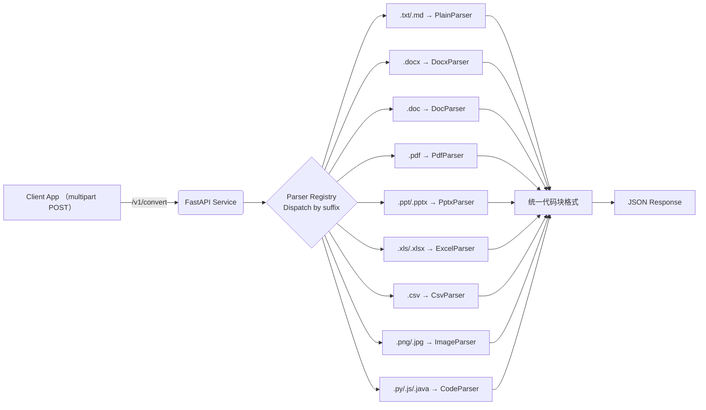

# MedicNex File2Markdown 设计文档

> **目标**：实现一个基于 Python 的微服务，接收用户通过 HTTP `POST` 上传的各种文档、图片、代码文件，将其内容转换为统一的 Markdown 代码块格式并返回。图片将调用视觉大模型完成内容识别与 OCR，结果同样以代码块形式返回。本服务需支持密钥（API Key）鉴权。

---

## 1. 技术栈与核心依赖

| 领域          | 选型                                                                                                                                                               | 说明                      |
| ----------- | ---------------------------------------------------------------------------------------------------------------------------------------------------------------- | ----------------------- |
| Web 框架      | **FastAPI** + Uvicorn                                                                                                                                            | 异步高性能，方便集成依赖注入与 OpenAPI |
| 数据验证        | **Pydantic v2**                                                                                                                                                  | 请求/响应模型校验               |
| 鉴权          | 自定义 API Key Header + HMAC/Redis 存储                                                                                                                               | 可水平扩展                   |
| 文档解析        | • `python-docx`（DOCX）<br>• `mammoth`（DOC→HTML→MD）<br>• `pdfplumber`（PDF）<br>• `python-pptx`（PPT/PPTX）<br>• `pandas` + `tabulate`（XLS/XLSX/CSV）<br>• 内置解析（TXT/MD）<br>• `chardet`（代码文件） | 统一输出代码块格式           |
| Markdown 生成 | **markdownify / mistune**                                                                                                                                        | 富文本 → MD                |
| 图片识别        | **OpenAI Vision API**（或其他视觉大模型） + **Tesseract OCR**（可选）                                                                                                          | 返回标签、描述与文字              |
| 日志          | **loguru**                                                                                                                                                       | JSON 结构化日志              |
| 部署          | Docker + Gunicorn/Uvicorn Worker                                                                                                                                 | 12‑factor 兼容            |

---

## 2. 统一输出格式

所有文件类型的转换结果都采用统一的 Markdown 代码块格式：

| 文件类型 | 输出格式 | 示例 |
|----------|----------|------|
| 代码文件 (83+语言) | `````python`, `````javascript` 等 | 对应语言的代码块 |
| 幻灯片文件 | `````slideshow` | PowerPoint 内容 |
| 图像文件 | `````image` | OCR + 视觉描述 |
| 纯文本文件 | `````text` | 文本内容 |
| 文档文件 | `````document` | Word/PDF 内容 |
| 表格文件 | `````sheet` | Excel/CSV 数据 |

### 输出示例

**Python 代码文件**：
```markdown
```python
def hello_world():
    print("Hello, World!")
    return "success"
```

**图像文件**：
```markdown
```image
# OCR:
识别的文字内容

# Description:
视觉模型的详细描述
```

**文档文件**：
```markdown
```document
# 文档标题

文档内容...
```

---

## 3. 功能概览



---

## 4. API 设计

### 4.1 端点

| Method | Path                | 功能              |
| ------ | ------------------- | --------------- |
| `POST` | `/v1/convert`       | 上传文件并返回转换结果     |
| `GET`  | `/v1/health`        | 健康检查            |
| `GET`  | `/v1/supported-types` | 获取支持的文件类型列表   |

### 4.2 请求

```http
POST /v1/convert HTTP/1.1
Host: api.example.com
Authorization: Bearer <API_KEY>
Content-Type: multipart/form-data; boundary=----WebKitForm

------WebKitForm
Content-Disposition: form-data; name="file"; filename="example.py"
Content-Type: text/x-python

<binary>
------WebKitForm--
```

### 4.3 响应

**代码文件响应**：
```jsonc
{
  "filename": "example.py",
  "size": 1024,
  "content_type": "text/x-python",
  "content": "```python\ndef hello_world():\n    print('Hello, World!')\n    return 'success'\n```",
  "duration_ms": 150
}
```

**图片文件响应**：
```jsonc
{
  "filename": "chart.png",
  "size": 204800,
  "content_type": "image/png",
  "content": "```image\n# OCR:\n图表标题：销售数据\n\n# Description:\n这是一个显示销售趋势的柱状图...\n```",
  "duration_ms": 2500
}
```

### 4.4 错误码

| HTTP | code               | 说明                      |
| ---- | ------------------ | ----------------------- |
| 401  | `INVALID_API_KEY`  | API Key 缺失或无效           |
| 415  | `UNSUPPORTED_TYPE` | 不支持的文件类型                |
| 422  | `PARSE_ERROR`      | 解析失败（详细信息在 `detail` 字段） |

---

## 5. 鉴权策略

1. **配置**：环境变量 `AGENT_API_KEYS="key1,key2,..."` 或持久化存储（Redis/PostgreSQL）。
2. **客户端**：须在 `Authorization` 头携带 `Bearer <API_KEY>`。
3. **服务端**：

   ```python
   from fastapi import Depends, HTTPException, Security, Header

   async def get_api_key(authorization: str = Header(...)):
       prefix, _, token = authorization.partition(" ")
       if prefix.lower() != "bearer" or token not in API_KEYS:
           raise HTTPException(401, "INVALID_API_KEY")
       return token
   ```

---

## 6. 解析器实现要点

| 文件类型           | 解析步骤                                                        | 输出格式 | 辅助库                      |
| -------------- | ----------------------------------------------------------- | ------- | ------------------------ |
| **TXT / MD**   | 直接 `str.decode()` 读入                                        | `text` | chardet |
| **DOCX**       | `python-docx` 遍历段落→HTML→`markdownify`                       | `document` | python-docx, markdownify |
| **DOC**        | `mammoth` ⟶ HTML ⟶ Markdown                                 | `document` | mammoth                  |
| **PDF**        | `pdfplumber` 抽取文本；若页面含图，保存临时 PNG 送 vision API               | `document` | pdfplumber, pillow       |
| **PPT / PPTX** | `python-pptx` 遍历 Slide→Shape；文本→列表，图片→临时文件                  | `slideshow` | python-pptx              |
| **XLS / XLSX** | `pandas.read_excel()`→`tabulate(table, tablefmt="github")`  | `sheet` | pandas, tabulate         |
| **CSV**        | `pandas.read_csv()` 同上                                      | `sheet` | pandas, tabulate         |
| **Image**      | Base64 → Vision API（标签，描述）+ `pytesseract.image_to_string()` | `image` | openai, pytesseract      |
| **Code Files** | 自动识别83+种编程语言，`chardet` 检测编码                              | 对应语言 | chardet                  |

### 支持的代码文件类型

| 语言类别 | 扩展名 | 输出格式 |
|----------|--------|----------|
| **主流编程语言** | `.py`, `.js`, `.ts`, `.java`, `.cpp`, `.c`, `.cs`, `.go`, `.rs`, `.php`, `.rb` | 对应语言代码块 |
| **前端技术** | `.html`, `.css`, `.scss`, `.sass`, `.less`, `.vue`, `.jsx`, `.tsx`, `.svelte` | 对应语言代码块 |
| **脚本语言** | `.r`, `.R`, `.lua`, `.perl`, `.pl`, `.sh`, `.bash`, `.zsh`, `.fish`, `.ps1` | 对应语言代码块 |
| **配置文件** | `.json`, `.yaml`, `.yml`, `.toml`, `.xml`, `.ini`, `.cfg`, `.conf` | 对应语言代码块 |
| **其他** | `.sql`, `.dockerfile`, `.makefile`, `.cmake`, `.gradle`, `.proto`, `.graphql` | 对应语言代码块 |

> **注意**：所有临时文件应存放在 `/tmp` 并在请求完成后删除，防止磁盘泄漏。

---

## 7. 视觉模型调用示例

```python
import openai, base64

def image_to_md(img_path: str) -> str:
    with open(img_path, "rb") as f:
        b64 = base64.b64encode(f.read()).decode()
    
    # 先获取 OCR 结果
    ocr_text = get_ocr_text(img_path)
    
    # 调用视觉模型获取描述
    rsp = openai.chat.completions.create(
        model="gpt-4o-mini",
        messages=[
            {
                "role": "user",
                "content": [
                    {
                        "type": "image_url",
                        "image_url": {
                            "url": f"data:image/png;base64,{b64}"
                        }
                    },
                    {"type": "text", "text": "请详细描述这张图片的内容，包括主要元素和布局。"}
                ],
            }
        ],
    )
    vision_description = rsp.choices[0].message.content
    
    # 返回统一格式
    return f"```image\n# OCR:\n{ocr_text}\n\n# Description:\n{vision_description}\n```"
```

---

## 8. 代码文件解析器实现

```python
from app.parsers.base import BaseParser
import chardet
import os

class CodeParser(BaseParser):
    # 文件扩展名到语言的映射
    EXTENSION_TO_LANGUAGE = {
        '.py': 'python',
        '.js': 'javascript',
        '.ts': 'typescript',
        '.java': 'java',
        '.cpp': 'cpp',
        '.c': 'c',
        '.go': 'go',
        '.rs': 'rust',
        '.php': 'php',
        '.rb': 'ruby',
        '.html': 'html',
        '.css': 'css',
        '.json': 'json',
        '.yaml': 'yaml',
        '.xml': 'xml',
        '.sql': 'sql',
        # ... 83+ 种语言
    }
    
    async def parse(self, file_path: str) -> str:
        # 检测编码
        with open(file_path, 'rb') as f:
            raw_data = f.read()
            encoding = chardet.detect(raw_data)['encoding'] or 'utf-8'
        
        # 读取内容
        with open(file_path, 'r', encoding=encoding) as f:
            content = f.read()
        
        # 获取语言类型
        ext = os.path.splitext(file_path)[1].lower()
        language = self.EXTENSION_TO_LANGUAGE.get(ext, 'text')
        
        # 返回代码块格式
        return f"```{language}\n{content.strip()}\n```"
```

---

## 9. 异常与限流

* 统一异常处理中间件，输出 `HTTPException(detail="PARSE_ERROR", extra=traceback)`。
* 使用 `slowapi` / `Redis` 实现基于 IP 与 API Key 双重限流。

---

## 10. 部署指南

```bash
# 1. 构建
$ docker build -t file2markdown:latest .

# 2. 运行
$ docker run -d -p 8080:8080 \
  -e AGENT_API_KEYS="sk-prod-123" \
  -e VISION_API_KEY="sk-vision-456" \
  file2markdown:latest
```

---

## 11. 目录结构参考

```
file2markdown/
├─ app/
│  ├─ main.py          # FastAPI 入口
│  ├─ auth.py          # 鉴权依赖
│  ├─ models.py        # Pydantic 模型
│  ├─ vision.py        # Vision 调用封装
│  ├─ routers/
│  │  └─ convert.py    # /v1/convert 实现
│  └─ parsers/
│     ├─ base.py       # 抽象 Parser
│     ├─ registry.py   # 解析器注册表
│     ├─ txt.py        # PlainParser
│     ├─ docx.py       # DocxParser
│     ├─ doc.py        # DocParser
│     ├─ pdf.py        # PdfParser
│     ├─ pptx.py       # PptxParser
│     ├─ excel.py      # ExcelParser
│     ├─ csv.py        # CsvParser
│     ├─ image.py      # ImageParser
│     └─ code.py       # CodeParser (NEW!)
├─ Dockerfile
├─ requirements.txt
├─ .env
└─ README.md
```

---

## 12. 性能优化与监控

- **异步处理**：所有解析器支持 `async/await`
- **临时文件管理**：自动清理机制防止内存泄漏
- **编码检测**：智能识别文件编码，支持多语言
- **错误追踪**：结构化日志记录处理时间和错误信息
- **健康检查**：提供服务状态监控端点

---

> **更新日志**：
> - v1.1: 新增 83+ 种代码文件支持
> - v1.1: 统一所有输出为代码块格式
> - v1.1: 增强换行符处理和编码检测
